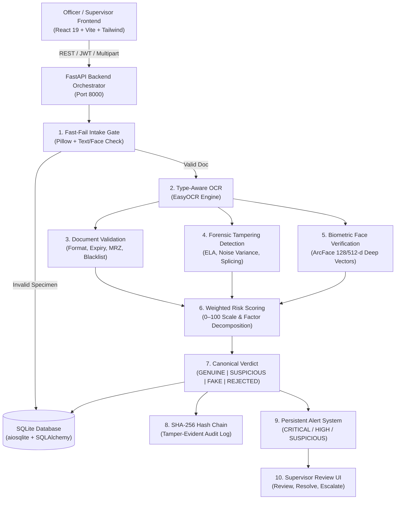

# 🛡️ AI-Based Fake Identity & Document Screening System (SIH26188)

**Ministry of Home Affairs (MHA) — Smart India Hackathon**  
*Comprehensive Border Security, Forensic Document Verification, Biometric Face Matching, and Tamper-Evident Audit Logging Platform.*

---

## 1. Project Purpose
The **AI-Based Fake Identity & Document Screening System** provides an end-to-end, high-throughput, forensic-grade screening platform for border checkpoints, immigration desks, and law enforcement agencies. It automatically detects forged credentials, manipulated identity documents, spliced portrait photos, expired or invalid records, and biometric face mismatches with sub-second execution.

---

## 2. System Architecture



---

## 3. Verification Pipeline
When an identity document and live selfie are submitted, the pipeline processes them sequentially:
1. **Intake Validation**: Checks for image integrity, valid size (<15MB), readable text, and human face presence.
2. **Type-Aware OCR**: Extracts structured fields based on declared document type (`PASSPORT`, `DRIVING_LICENSE`, `NATIONAL_ID`, `VISA`, `PERMIT`).
3. **Format & Rule Checks**: Validates regex formats, expiry dates, and mathematical MRZ check digits.
4. **Forensic Analysis**: Generates Error Level Analysis (ELA) heatmaps and identifies spliced bounding boxes.
5. **Biometric Face Verification**: Compares facial features between the document portrait and the live selfie.
6. **Risk Scoring & Verdict**: Synthesizes all forensic indicators into a 0–100 risk score and definitive verdict.
7. **Persistence & Alerting**: Saves full structured case data, writes to the SHA-256 audit chain, and triggers supervisor alerts for high-risk cases.

---

## 4. OCR Engine
- Powered by **EasyOCR** with CPU and GPU acceleration support.
- Preprocesses images with adaptive thresholding, contrast equalization, and noise suppression.
- Extracts key fields: Full Name, Date of Birth (DOB), Document Number, Expiry Date, Nationality, Address, and Issuing Authority.

---

## 5. Document Validation
- **Driving Licenses**: Validates state code formats, issue/expiry chronological consistency.
- **Passports**: Validates 8/9 alphanumeric passport numbers and country codes.
- **National IDs**: Validates 12-digit Aadhaar / standard national ID format rules.
- **Visas**: Validates entry types, multi-entry validity periods, and issuing mission codes.
- **Category Match Gate**: Automatically classifies uploaded document against selected type; flags mismatch as hard gate failure.

---

## 6. MRZ & Checksum Verification
- Supports **ICAO 9303** standard Machine Readable Zones (TD1, TD2, TD3 format).
- Calculates check digits using 7-3-1 weighting algorithm on Document Number, DOB, and Expiry Date.
- Validates composite check digits and extracts standardized MRZ fields.
- Checks document numbers and holder names against simulated national security watchlists.

---

## 7. Tampering Detection
- **Error Level Analysis (ELA)**: Re-compresses image at known quality level to measure compression artifact disparities.
- **Noise Analysis**: Evaluates high-frequency Laplacian variance across localized text and photo regions.
- **Palette Heatmap**: Generates forensic color-mapped JPEG base64 heatmap for inspector visual review.
- **Bounding Boxes**: Returns precise coordinates `[x, y, w, h]` and confidence scores for suspicious regions.

---

## 8. Face Verification & Biometrics
- **Core DeepFace / ArcFace Architecture**: Extracts normalized facial feature embeddings from document portrait and live selfie.
- **Cosine Distance Correlation**: Calculates biometric vector distance against a calibrated threshold (0.68).
- **Anti-Spoofing & Liveness**: Evaluates texture flatness (print attack) and periodic moiré patterns (screen replay).
- **Quality Assessment**: Measures sharpness (Laplacian variance) and illumination/exposure extremes.

---

## 9. Risk Scoring
The primary metric is a normalized 0–100 integer score computed via weighted evaluation:
- **Tampering Score (35%)**: Weight of ELA and noise variance anomalies.
- **Face Mismatch (35%)**: Penalty for biometric vector divergence (<50% match adds up to +35 risk).
- **Validation Issues (20%)**: Penalties for format failures, expired documents, and check digit errors.
- **Security Hard Gates (10%)**: Category mismatch, presentation attack, or blacklist hit forces score to 90–100.

---

## 10. Verdict Generation
- **GENUINE** (`risk_score < 30`): All security checks passed; low forensic risk.
- **SUSPICIOUS** (`30 <= risk_score < 70`): Moderate risk, borderline face correlation, or minor validation warnings.
- **FAKE** (`risk_score >= 70`): Splicing detected, forged check digits, or critical biometric mismatch.
- **REJECTED**: Malformed input, non-document image, or declared category mismatch.

---

## 11. Persistent Alert System
- High-risk (`FAKE`, `SUSPICIOUS`, `REJECTED`) verifications automatically create persistent records in SQLite `alerts` table.
- **Severity Levels**: `CRITICAL` (score ≥ 80), `HIGH` (score ≥ 60), `SUSPICIOUS` (score ≥ 40), `INFO` (low risk).
- Alerts contain officer email, checkpoint location, timestamps, and forensic indicators.

---

## 12. Supervisor Review Workflow
- **RBAC Enforcement**: Only users with the `SUPERVISOR` role can update alert statuses (`REVIEWED`, `RESOLVED`, `ESCALATED`).
- Attempted review by an `OFFICER` returns `403 Forbidden`.
- Review actions record supervisor email, review timestamp, and review notes in database and audit chain.

---

## 13. Audit Logging (Cryptographic Hash Chain)
- Every verification event, alert creation, and supervisor review is appended to a tamper-evident audit ledger (`audit_log.json`).
- Each block contains: `index`, `timestamp`, `record_data`, `previous_hash`, and current `hash` (SHA-256).
- Endpoint `GET /audit-log/verify` cryptographically re-computes the entire chain to detect any manual database tampering.

---

## 14. Authentication & Role-Based Access Control (RBAC)
- **JWT (JSON Web Token)** based authentication using HS256 algorithm.
- Roles: `OFFICER` (document verification, history view) and `SUPERVISOR` (operational statistics, alert reviews, audit inspections).
- Endpoints enforce authentication with `401 Unauthorized` on missing/invalid tokens and `403 Forbidden` on unauthorized roles.

---

## 15. Database
- **SQLite 3** managed asynchronously via **SQLAlchemy 2.0** and **aiosqlite**.
- Models: `User`, `Verification`, `Alert`.
- Fully indexed on `verdict`, `document_type`, `checkpoint_location`, and `timestamp` for sub-10ms history queries.

---

## 16. Installation & Setup

### Prerequisites
- Python 3.10+ (Tested on Python 3.12 / 3.14)
- Node.js 18+ and npm

### Backend Setup
```bash
# Create virtual environment
python -m venv .venv
.venv\Scripts\activate      # Windows
# source .venv/bin/activate  # Linux/macOS

# Install dependencies
pip install -r requirements.txt
```

### Frontend Setup
```bash
cd frontend
npm install
```

---

## 17. Running Frontend & Backend

### Start Backend
```bash
# From repository root
.venv\Scripts\python.exe -m uvicorn app.main:app --host 0.0.0.0 --port 8000 --reload
```
API Documentation: [http://localhost:8000/docs](http://localhost:8000/docs)

### Start Frontend
```bash
cd frontend
npm run dev
```
Web Application: [http://localhost:5173](http://localhost:5173) (or 5174)

### Default Demo Credentials
| Role | Email | Password | Assigned Checkpoint |
|---|---|---|---|
| **Officer** | `officer.attari@mha.gov.in` | `Password@123` | Attari-Wagah Border |
| **Officer** | `officer.petrapole@mha.gov.in` | `Password@123` | Petrapole-Benapole Crossing |
| **Supervisor** | `supervisor.delhi@mha.gov.in` | `Password@123` | Border HQ (All Checkpoints) |
| **Admin** | `admin@mha.gov.in` | `Password@123` | Central Command |

---

## 18. Testing & Validation

### Run Full Test Suite
```bash
.venv\Scripts\python.exe -m pytest -q
```
*Expected: 99 passed in < 45 seconds.*

### Run Phase 4 Production Matrix
```bash
.venv\Scripts\python.exe -m pytest -q tests/test_phase4_production_matrix.py
```
*Expected: 12 passed in < 2.5 minutes.*

### Run Frontend Build
```bash
cd frontend
npm run build
```
*Expected: TypeScript typecheck passes and Vite bundle compiles with 0 errors.*

---

## 19. Limitations
- OCR accuracy is dependent on input image resolution (minimum recommended: 300 DPI or 1000px width).
- Synthetic/sketched drawings without realistic facial geometry will trigger face detection or liveness fallbacks.
- Hardware acceleration (CUDA) is optional; CPU inference takes 1.2–2.5s per verification.

---

## 20. Future Scope
- Integration with live national border gate hardware (optical passport scanners, biometric iris readers).
- On-device edge deployment using TensorRT / ONNX Runtime.
- Support for multi-lingual regional identity documents (Devanagari, Bengali, Tamil, etc.).
